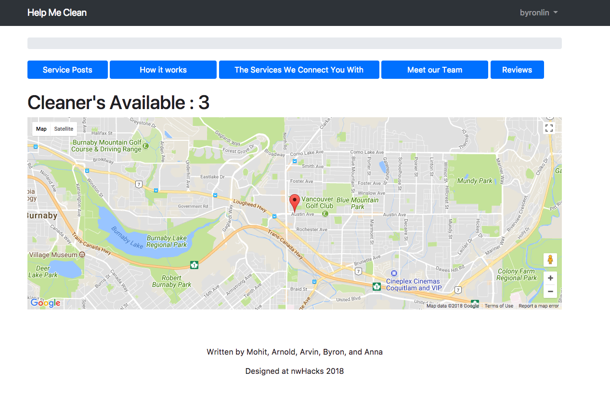

# NwHacksApp2018
Cleaning services web app allows cleaners to post their services and customers to select and schedule those services.

# Setup

1. create virtual env within repo: `virtualenv venv -p python3`
2. activate virtual env: `source venv/bin/activate`
3. `python manage.py makemigrations`
4. `python manage.py migrate`
5. `python manage.py runserver` and use pip to install any missing packages (eg. Django)
